# ĐỒ ÁN TỐT NGHIỆP ĐẠI HỌC
## NGÀNH KỸ THUẬT MÁY TÍNH - KHOA CÔNG NGHỆ THÔNG TIN

### ĐỀ TÀI: XÂY DỰNG ỨNG DỤNG CHATBOT TRÊN NỀN TẢNG ANDROID HỖ TRỢ GIÁO VIÊN CHỦ NHIỆM VÀ CỐ VẤN HỌC TẬP CHO SINH VIÊN HỆ ĐÀO TẠO TỪ XA TRƯỜNG ĐHKTCN (TNUT)

[](#)
[](#)
[](#)
[](#)
[](#)

---

## 1. Tóm tắt đề tài & Demo trực quan (Abstract & Visual Demo)

### Tóm tắt đề tài
Đối với sinh viên học hệ đào tạo từ xa tại Trường Đại học Kỹ thuật Công nghiệp (TNUT), việc tự học và tìm kiếm thông tin về quy chế, chương trình đào tạo hay điểm số cá nhân thường gặp nhiều trở ngại do khoảng cách địa lý. Các kênh hỗ trợ truyền thống như Website, Email hay mạng xã hội thường bị quá tải do số lượng yêu cầu lớn, dẫn đến phản hồi chậm.

Để giải quyết bài toán này, em đã xây dựng hệ thống **TNUT AI Chatbot**. Đây là một giải pháp ứng dụng kỹ thuật **RAG (Retrieval-Augmented Generation)** kết hợp mô hình ngôn ngữ lớn **Google Gemini 2.5 Flash** để hỗ trợ giải đáp thắc mắc tự động 24/7. Hệ thống bao gồm:
*   **Android App (Kotlin):** Ứng dụng di động dành cho sinh viên với giao diện chat thân thiện, hỗ trợ lưu lịch sử chat, đăng nhập Google OAuth.
*   **FastAPI Backend (Microservices):** Tách biệt dịch vụ xác thực người dùng (Auth) và dịch vụ xử lý ngôn ngữ tự nhiên (Chatbot RAG).
*   **Admin Frontend (React):** Trang quản trị dành cho Giáo viên chủ nhiệm / Cố vấn học tập quản lý người dùng và dữ liệu tri thức.

---

### Thông tin nhóm thực hiện
*   **Sinh viên thực hiện:** Vũ Ngọc Trang
*   **Mã số sinh viên (MSSV):** K205480106035
*   **Lớp:** 56KTMT (Khóa 56)
*   **Ngành:** Kỹ thuật máy tính
*   **Khoa:** Công nghệ thông tin
*   **Giảng viên hướng dẫn:** ThS. Trần Thị Thanh
*   **Đơn vị đào tạo:** Trường Đại học Kỹ thuật Công nghiệp Thái Nguyên (TNUT)

---

### Demo Giao diện Ứng dụng di động (Android App screenshots)

| Màn hình chào mừng | Màn hình đăng nhập | Đăng ký tài khoản | Đăng nhập Google |
| :---: | :---: | :---: | :---: |
| 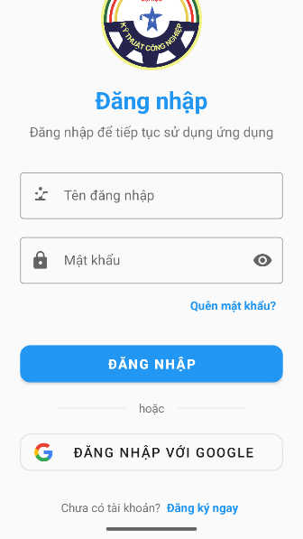 |  | 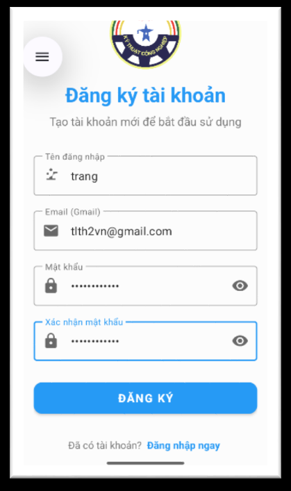 | 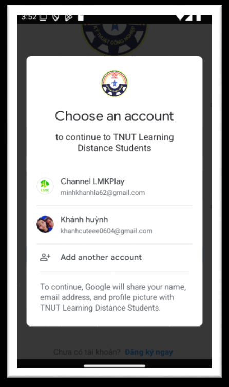 |

| Hộp thoại trống | Giao diện Chatbot trả lời | Thông tin người dùng | Đăng xuất |
| :---: | :---: | :---: | :---: |
| 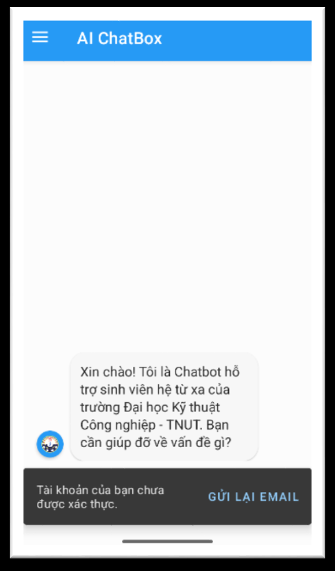 | 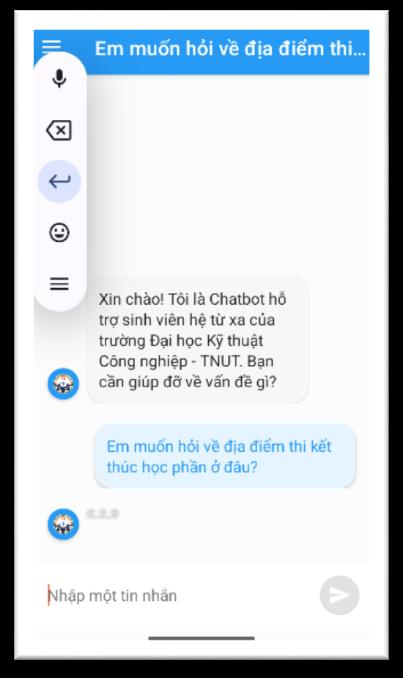 |  | 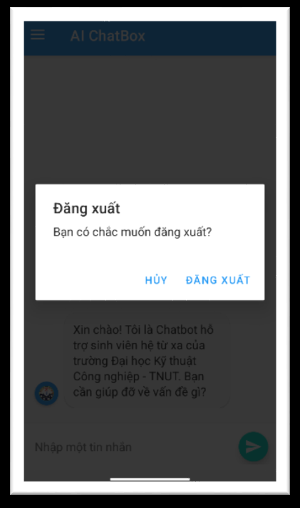 |

---

## 2. Phương pháp & Kiến trúc Hệ thống (System Architecture & Methods)

Hệ thống được thiết kế theo kiến trúc Microservices phân tách độc lập nhằm tối ưu hóa hiệu năng, tính bảo mật và khả năng mở rộng trong tương lai.

### Sơ đồ kiến trúc tổng quan (System Architecture)
Dưới đây là luồng dữ liệu tương tác giữa các thành phần trong hệ thống:

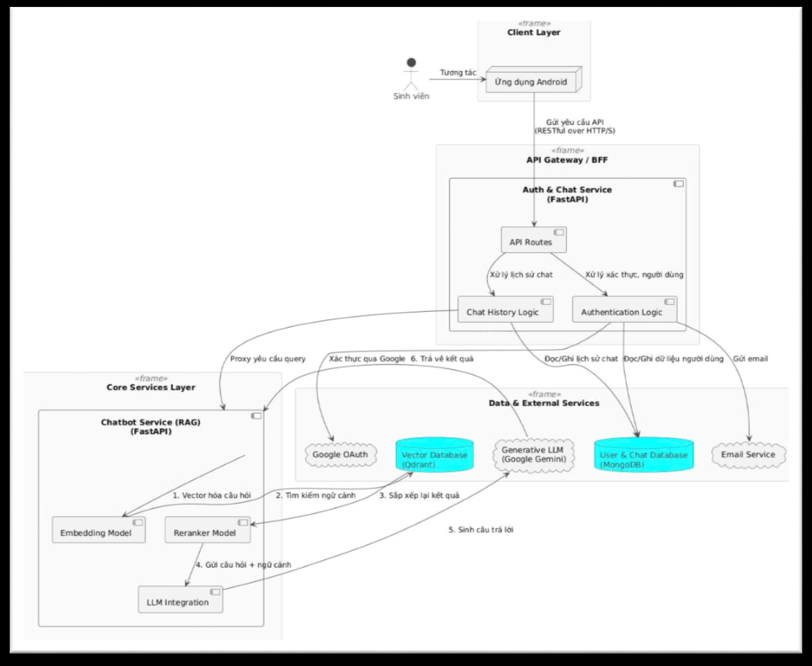

#### Luồng hoạt động chính:
1.  **Giao tiếp Client-Server:** Ứng dụng Android gửi yêu cầu đến Gateway/Load Balancer, sau đó phân luồng đến các microservices backend thông qua giao thức HTTP RESTful API.
2.  **Hệ thống Xác thực (backend_auth):** Xử lý đăng ký, đăng nhập truyền thống, gửi mã OTP xác thực qua SMTP, Google OAuth 2.0 (Google Login), mã hóa mật khẩu bằng bcrypt và cấp phát mã truy cập bảo mật dưới dạng **JWT Token**. Dữ liệu tài khoản được lưu trữ an toàn trong cơ sở dữ liệu **MongoDB**.
3.  **Hệ thống RAG Chatbot (backend_chatbot):** Nhận câu hỏi từ sinh viên, tiến hành tiền xử lý, kiểm tra xem câu hỏi có chứa thông tin định danh sinh viên hay không (thông qua bộ lọc regex tối ưu) để thực hiện tìm kiếm kết hợp (**Hybrid Search**).
4.  **Retrieval-Augmented Generation (RAG Pipeline):**
    *   **Vector Database (Qdrant):** Lưu trữ các phân đoạn văn bản quy chế học vụ dạng nhúng vector được tạo bởi mô hình `sentence-transformers/paraphrase-multilingual-mpnet-base-v2`.
    *   **Reranker:** Sử dụng mô hình `amberoad/bert-multilingual-passage-reranking-msmarco` để tái sắp xếp điểm số của 15 tài liệu có độ tương đồng cao nhất, chọn ra 8 tài liệu sát ngữ cảnh nhất (Top 8).
    *   **Generative AI (Gemini 2.5 Flash):** Ngữ cảnh sau khi tái sắp xếp cùng với câu hỏi gốc và Prompt mẫu Tiếng Việt sẽ được gửi qua API của Google để sinh ra câu trả lời cuối cùng có cấu trúc rõ ràng, chuyên nghiệp.

---

### Thiết kế Use Case & Class Diagram

#### 1. Sơ đồ Use Case Xác thực và Quản lý Tài khoản (Authentication Use Case)
Định nghĩa các tác vụ của sinh viên khi tương tác với hệ thống đăng ký, đăng nhập, bảo mật tài khoản.

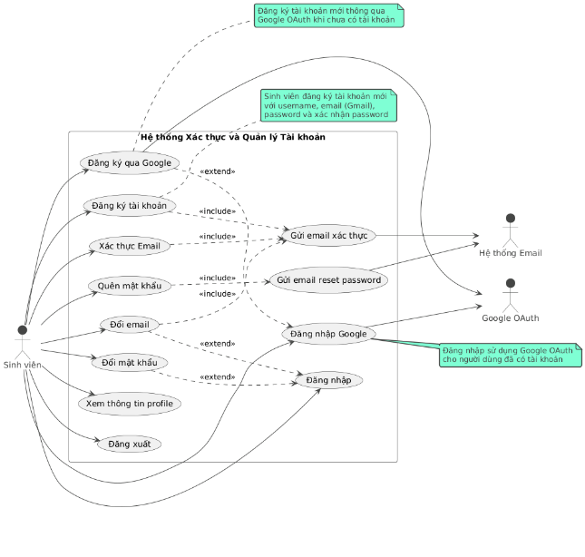

#### 2. Sơ đồ Use Case Chat và Tương tác với AI (Chat & AI Interaction Use Case)
Mô tả các chức năng cốt lõi của sinh viên khi gửi câu hỏi tra cứu, xem lịch sử và nhận phản hồi từ mô hình ngôn ngữ RAG.

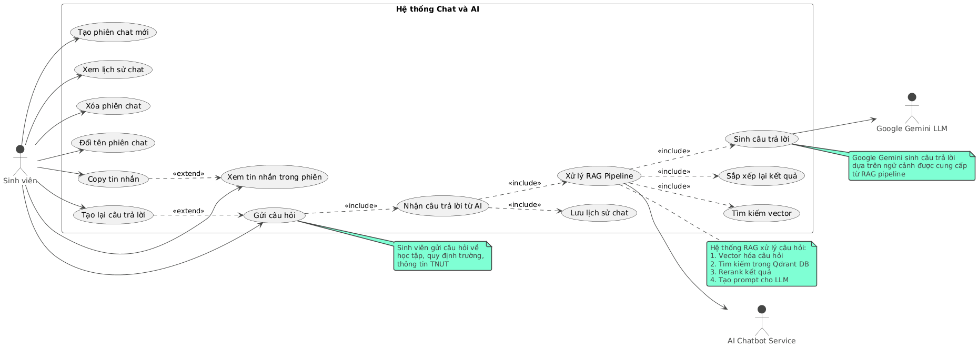

#### 3. Sơ đồ Use Case Backend và Quản lý Dữ liệu (Backend & Admin Use Case)
Mô tả các hành vi quản trị của cố vấn học tập / giáo viên chủ nhiệm như thêm mới dữ liệu đào tạo, theo dõi lượng truy cập và cập nhật tri thức cho chatbot.

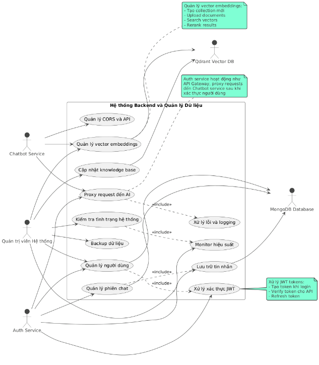

#### 4. Sơ đồ Class Diagram (Lớp dữ liệu ứng dụng Android)
Định nghĩa mối quan hệ giữa các đối tượng dữ liệu trong ứng dụng di động Android: `User`, `ChatSession`, `ChatMessage`, các API client và repository.

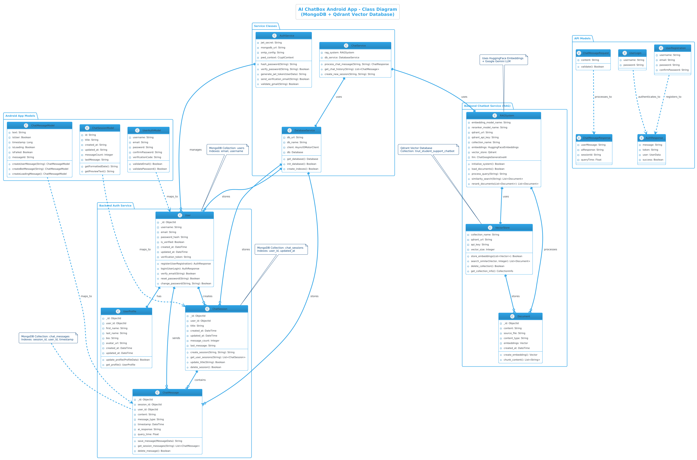

---

## 3. Kết quả Thực nghiệm & Đánh giá (Quantitative Results)

Để đánh giá chất lượng câu trả lời của chatbot, em đã xây dựng một tập dữ liệu thử nghiệm độc lập gồm **15 câu hỏi thực tế** đại diện cho các vấn đề thường gặp nhất của sinh viên hệ từ xa TNUT (quy chế điểm danh, lịch thi, cách tính điểm chữ, chuẩn đầu ra tiếng Anh, học phí,...). 

Phương pháp đánh giá sử dụng framework **BERTScore** nhằm so sánh độ tương đồng ngữ nghĩa giữa câu trả lời của chatbot và câu trả lời chuẩn do cố vấn học tập biên soạn.

### Kết quả đo lường độ chính xác (Precision, Recall, F1-Score)

| STT | Nội dung câu hỏi thử nghiệm | Precision | Recall | F1-Score |
|:---:|:---|:---:|:---:|:---:|
| 1 | Quy định về chuẩn đầu ra ngoại ngữ của trường như thế nào? | 0.8954 | 0.8842 | 0.8898 |
| 2 | Làm sao để đăng ký học cải thiện điểm số? | 0.8541 | 0.8621 | 0.8581 |
| 3 | Quy trình nộp đơn xin tạm hoãn nghĩa vụ quân sự | 0.9102 | 0.8974 | 0.9037 |
| 4 | Học phí cho mỗi tín chỉ hệ đào tạo từ xa là bao nhiêu? | 0.9234 | 0.9312 | 0.9273 |
| 5 | Cách tính điểm trung bình tích lũy hệ 4? | 0.8812 | 0.8756 | 0.8784 |
| 6 | Thời gian tối đa để hoàn thành chương trình học là mấy năm? | 0.8415 | 0.8529 | 0.8471 |
| 7 | Sinh viên hệ từ xa có được cấp thẻ sinh viên không? | 0.7915 | 0.8124 | 0.8018 |
| 8 | Lịch thi học kỳ được công bố trước bao nhiêu ngày? | 0.8633 | 0.8571 | 0.8602 |
| 9 | Làm thế nào nếu bị mất mật khẩu tài khoản học trực tuyến? | 0.8124 | 0.8354 | 0.8237 |
| 10| Các mức xếp loại học lực khi tốt nghiệp là gì? | 0.9045 | 0.8912 | 0.8978 |
| 11| Tôi có thể rút bớt học phần đã đăng ký không và hạn là khi nào? | 0.7654 | 0.7812 | 0.7731 |
| 12| Điều kiện để được xét nhận học bổng khuyến khích học tập? | 0.8431 | 0.8398 | 0.8414 |
| 13| Phương pháp cân bằng giữa học tập trực tuyến và công việc đi làm? | 0.6482 | 0.6671 | 0.6575 |
| 14| Mô tả cho tôi về học phần Triết học Mác Lê-nin | 0.9141 | 0.9219 | 0.9180 |
| 15| Kênh Fanpage chính thức của nhà trường là gì? | 0.8713 | 0.9044 | 0.8875 |
| **-** | **Kết quả Trung bình Toàn hệ thống** | **0.8288 (82.88%)** | **0.8256 (82.56%)** | **0.8258 (82.58%)** |

### Đánh giá hiệu năng và trải nghiệm người dùng
*   **Độ trễ phản hồi (Response Latency):** Thời gian trung bình để hệ thống xử lý RAG, gọi mô hình tạo sinh và trả câu trả lời về điện thoại là **dưới 2 giây** (trong điều kiện mạng ổn định).
*   **Ưu điểm:** Khả năng xử lý câu hỏi Tiếng Việt tự nhiên rất tốt, phân tích đúng các câu hỏi mang tính tra cứu thông tin chính thức có cấu trúc rõ ràng. Thiết kế RecyclerView giúp hiển thị giao diện bong bóng chat mượt mà, hỗ trợ render trực tiếp các bảng biểu, danh sách bằng Markdown thông qua thư viện Markwon.
*   **Hạn chế hiện tại:** Độ chính xác giảm xuống đối với các câu hỏi mang tính chất lời khuyên chung chung hoặc mơ hồ (như câu hỏi số 13 về cân bằng học tập - công việc, F1-Score đạt 65.75%). Hệ thống vẫn phụ thuộc nhiều vào chất lượng của bộ dữ liệu nguồn được nạp vào vector DB.

---

## 4. Quy trình DevOps & Triển khai (DevOps & Deploy)

Hệ thống cung cấp sẵn cấu hình Docker hóa toàn diện bằng Multi-stage Dockerfile giúp dễ dàng đóng gói và triển khai ứng dụng trên máy chủ hoặc môi trường Linux.

### Kiến trúc đóng gói (Multi-stage Docker Build)
`Dockerfile` ở thư mục gốc được chia làm 4 giai đoạn độc lập nhằm giảm thiểu dung lượng image cuối cùng:
1.  **Stage 1 (`convert-stage`):** Khởi tạo môi trường Python 3.11-slim, sao chép thư mục tài liệu `dataset/`, cài đặt thư viện chuyển đổi và chạy script `convert_pdfs.py` để trích xuất toàn bộ nội dung PDF thành file văn bản Markdown cấu trúc sạch.
2.  **Stage 2 (`chatbot-stage`):** Cài đặt các thư viện cần thiết cho chatbot như PyTorch, Hugging Face Transformers, Qdrant Client, LangChain.
3.  **Stage 3 (`auth-stage`):** Cài đặt các thư viện phục vụ cho dịch vụ xác thực như Motor, PyMongo, PyJWT, passlib, bcrypt.
4.  **Final Stage (Production):** Tạo một image nền Python 3.11-slim sạch, cài đặt **Supervisor** để quản lý tiến trình. Sao chép lại toàn bộ các gói thư viện Python đã cài sẵn từ Stage 2 và Stage 3, sao chép mã nguồn của hai Backend (`backend_auth/`, `backend_chatbot/`), sao chép tài liệu Markdown từ Stage 1. Cuối cùng, khởi động supervisor để chạy song song cả hai cổng dịch vụ (5000 và 8000).

---

### Quy trình khởi chạy bằng Docker
Trước khi khởi chạy container, bạn cần tạo hai file cấu hình môi trường `.env` dựa theo file `.env.example` có sẵn trong mỗi thư mục backend.

#### Bước 1: Chuẩn bị file `.env`

**Cấu hình cho auth (`backend_auth/.env`):**
```env
MONGODB_URL=mongodb://<domain_or_ip>:27017
DATABASE_NAME=aichatbox
JWT_SECRET_KEY=your_super_secret_key
JWT_ACCESS_TOKEN_EXPIRES_MINUTES=60
MAIL_USERNAME=example@gmail.com
MAIL_PASSWORD=your_app_password
MAIL_FROM=example@gmail.com
GOOGLE_CLIENT_ID=your_google_id.apps.googleusercontent.com
GOOGLE_CLIENT_SECRET=your_google_secret
CHATBOT_SERVICE_URL=http://localhost:5000
```

**Cấu hình cho chatbot (`backend_chatbot/.env`):**
```env
QDRANT_URL=http://<domain_or_ip>:6333
QDRANT_API_KEY=your_qdrant_key
GEMINI_API_KEY=your_google_gemini_key
HUGGINGFACE_API_KEY=your_hugging_face_token
```

#### Bước 2: Build Image từ Dockerfile
Mở Terminal tại thư mục gốc chứa `Dockerfile` và thực hiện lệnh:
```bash
docker build -t tnut-chatbot-system:latest .
```

#### Bước 3: Chạy Container
Khởi động container và liên kết các tệp biến môi trường cùng các cổng dịch vụ:
```bash
docker run -d \
  --name tnut-chatbot-app \
  -p 5000:5000 \
  -p 8000:8000 \
  --env-file ./backend_auth/.env \
  --env-file ./backend_chatbot/.env \
  tnut-chatbot-system:latest
```

Hệ thống sẽ chạy ngầm thông qua Supervisor:
*   Dịch vụ Chatbot (FastAPI) lắng nghe tại cổng **5000**.
*   Dịch vụ Xác thực & Người dùng (FastAPI) lắng nghe tại cổng **8000**.

---

### Quy trình chạy thủ công trên máy Local (Development Setup)

#### 1. Cài đặt các cơ sở dữ liệu nền tảng
*   Cài đặt và khởi chạy **MongoDB** trên cổng mặc định `27017`.
*   Cài đặt và khởi chạy **Qdrant Vector Database** trên cổng mặc định `6333` (Khuyên dùng docker):
    ```bash
    docker run -p 6333:6333 -p 6334:6334 -v qdrant_storage:/qdrant/storage qdrant/qdrant
    ```

#### 2. Khởi chạy Backend Auth
```bash
cd backend_auth
python -m venv venv
venv\Scripts\activate   # Trên Windows
pip install -r requirements.txt
python main.py
```

#### 3. Khởi chạy Backend Chatbot & Nạp cơ sở dữ liệu tri thức
Khi khởi chạy lần đầu tiên, hệ thống sẽ tự động đọc các tài liệu Markdown trong thư mục `dataset/`, tạo embeddings và đẩy lên Qdrant:
```bash
cd backend_chatbot
python -m venv venv
venv\Scripts\activate   # Trên Windows
pip install -r requirements.txt
python main.py
```

#### 4. Khởi chạy Admin Portal (React Web)
```bash
cd admin-frontend
npm install
npm start
```
Giao diện quản trị sẽ mở ra tại địa chỉ `http://localhost:3000`.

#### 5. Khởi chạy Android App
*   Mở thư mục `android_app` bằng phần mềm **Android Studio**.
*   Đồng bộ Gradle và cập nhật địa chỉ IP của server Backend trong tệp cấu hình API Endpoint của ứng dụng.
*   Chạy ứng dụng trên máy ảo Emulator hoặc cắm thiết bị thật để trải nghiệm.

---

## 5. Cấu trúc Thư mục Dự án (Directory Structure)

```text
TNUT_Chatbot_Mobile/
├── admin-frontend/         # Mã nguồn trang quản trị Web (React, Ant Design)
│   ├── public/
│   ├── src/
│   ├── package.json
│   └── ...
├── android_app/            # Ứng dụng di động Android (Kotlin)
│   ├── app/
│   │   ├── src/            # Code xử lý logic Android và Layout UI XML
│   │   └── build.gradle.kts
│   ├── gradle/
│   └── settings.gradle.kts
├── backend_auth/           # Microservice quản lý xác thực & người dùng (FastAPI, MongoDB)
│   ├── auth.py             # Logic đăng nhập, đăng ký, cấp phát JWT Token
│   ├── auth_routes.py      # Định nghĩa các REST API endpoint cho xác thực
│   ├── database.py         # Kết nối cơ sở dữ liệu MongoDB thông qua Motor
│   ├── main.py             # Điểm chạy dịch vụ (Cổng 8000)
│   ├── requirements.txt    # Các thư viện Python cần thiết cho Auth
│   └── .env.example
├── backend_chatbot/        # Microservice xử lý AI Chatbot & RAG (FastAPI, Qdrant)
│   ├── rag.py              # Pipeline RAG: Nhúng vector, Reranking, Sinh văn bản với Gemini
│   ├── evaluate.py         # Framework đánh giá độ chính xác (BERTScore)
│   ├── main.py             # Điểm chạy dịch vụ (Cổng 5000)
│   ├── requirements.txt    # Các thư viện Python cần thiết cho Chatbot
│   └── .env.example
├── dataset/                # Cơ sở tri thức của hệ thống (Quy chế tuyển sinh, chương trình học)
│   ├── *.pdf               # Các quy định gốc của nhà trường dạng PDF
│   ├── *.md                # Dữ liệu sau khi trích xuất và tối ưu hóa cấu trúc Markdown
│   ├── convert_pdfs.py     # Script chuyển đổi tự động PDF -> Markdown
│   └── requirements.txt
├── docs/                   # Tài liệu đồ án và tài nguyên hình ảnh hiển thị
│   ├── images/             # Hình ảnh sơ đồ kiến trúc và giao diện đính kèm trong README
│   ├── Vu_Ngoc_Trang_ĐÁTN.pdf  # Bản báo cáo đồ án tốt nghiệp chi tiết (PDF)
│   └── Vũ Ngọc Trang - K205480106035.pdf # Slide thuyết trình bảo vệ đồ án tốt nghiệp
├── classdiagrams.png       # Bản vẽ Class Diagram gốc dạng ảnh độ phân giải cao
├── Dockerfile              # Multi-stage Dockerfile cấu hình đóng gói tự động
├── supervisord.conf        # File cấu hình quản lý tiến trình Supervisor
├── entrypoint.sh           # Script entrypoint cho Docker container
└── .gitignore
```

---

## 6. Tech Stack & Lời cảm ơn (Tech Stack & Acknowledgments)

### Công nghệ sử dụng (Tech Stack)
*   **Mobile App:** Kotlin, ViewBinding, DataBinding, Coroutines, Retrofit (Networking), Lottie (Loading Animation), Glide (Image caching), Markwon (Markdown rendering).
*   **Admin Frontend:** ReactJS 18, Ant Design components, Styled Components, Axios.
*   **Microservices Backend:** FastAPI (Asynchronous framework), Uvicorn Server, Python 3.11.
*   **AI & RAG Framework:** LangChain, Hugging Face Embeddings (`paraphrase-multilingual-mpnet-base-v2`), BERT Reranker (`bert-multilingual-passage-reranking-msmarco`), Google Generative AI (`gemini-2.5-flash`).
*   **Databases:** MongoDB (Auth, Chat History), Qdrant Vector Database (Document Embeddings).
*   **DevOps & Tools:** Docker (Multi-stage build), Supervisor (Process Management), Git.

---

### Tài liệu tham khảo chủ yếu
1.  Vaswani, A., Shazeer, N., Parmar, N., Uszkoreit, J., Jones, L., Gomez, A. N., Kaiser, Ł., & Polosukhin, I. (2017). *Attention is all you need*. Advances in Neural Information Processing Systems.
2.  Lewis, P., Perez, E., Piktus, A., Petroni, F., Lewis, V., Riedel, S., & Kiela, D. (2020). *Retrieval-augmented generation for knowledge-intensive NLP tasks*. arXiv preprint arXiv:2005.11401.
3.  Tài liệu hướng dẫn phát triển của Google Gemini API & LangChain Framework: https://python.langchain.com
4.  Quy chế đào tạo từ xa, Sổ tay sinh viên và Quy chế học vụ Trường Đại học Kỹ thuật Công nghiệp (TNUT).

---

### Lời cảm ơn
Để hoàn thành đồ án tốt nghiệp này, trước hết em xin gửi lời cảm ơn chân thành và sâu sắc nhất tới **Cô ThS. Trần Thị Thanh** - giảng viên hướng dẫn trực tiếp của em. Trong suốt quá trình em học tập và thực hiện đề tài, cô đã luôn tận tình định hướng, chỉ bảo và cung cấp những tài liệu, quy trình thực hiện vô cùng quý báu, giúp em vượt qua các thử thách kỹ thuật và hoàn thiện hệ thống một cách tối ưu.

Em cũng xin chân thành cảm ơn các thầy cô giáo trong Khoa Công nghệ Thông tin - Trường Đại học Kỹ thuật Công nghiệp Thái Nguyên đã trang bị cho em những kiến thức chuyên môn vững chắc làm nền tảng cốt lõi trong suốt 4 năm học vừa qua. Dù đã có nhiều cố gắng tự hoàn thiện hệ thống, đồ án khó tránh khỏi những thiếu sót nhất định. Em rất mong nhận được những ý kiến đóng góp, nhận xét từ phía các thầy cô và các bạn sinh viên để sản phẩm ngày một hoàn thiện hơn.

*Thái Nguyên, năm 2025.*  
**Sinh viên thực hiện**  
*Vũ Ngọc Trang*
